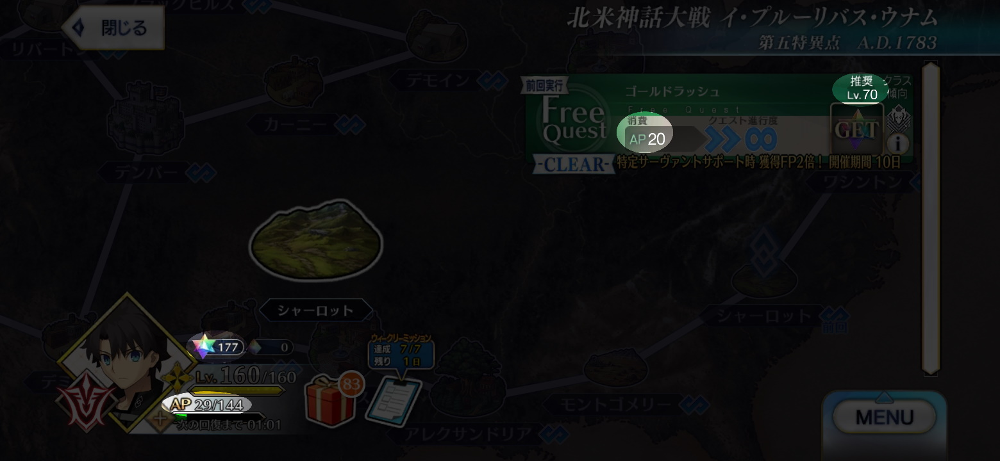

# FGO AP calculator

FGOで聖晶石を消費して周回するときに、残りの聖晶石がいくつになったら目標周回数に達するのかをざっと見積もるWebツールです。

## 使い方

1. 周回を始めるときに https://antenna-three.github.io/fgoapcalc/ を開きます。

2. 周回開始時刻およびFGOの聖晶石所持数・AP、クエストの消費AP・推奨レベルを入力します。

    

3. 正確な周回数を計測するために、以下の条件を満たすサーヴァントの累計絆ポイントを入力します。

    - 周回パーティに常に編成されている。
    - 周回中に絆レベルが上限に到達しない。
    - 周回計測中に他のクエストに出撃しない。

    累計絆ポイントはサーヴァントステータス画面の絆レベルをタップすることで確認できます。スクリーンショットにて保存しておくことを推奨します。

4. 累計絆ポイントを入力したサーヴァントが受ける絆ボーナスを入力します。単位が%の欄には礼装効果とイベントボーナスの合計、単位がptの欄には英霊肖像の効果を入力します。チェックボックスは入力の補助で、計算には使われません。

5. 周回予定数を入力します。

6. 「計算」ボタンを押します。周回予定数だけ周回した後の累計絆ポイント、聖晶石所持数、APの予想が表示されます。

## 使用上の注意

- 計算結果にはAPの自然回復が反映され、5分ごとに再計算されます。
- 入力内容はブラウザに自動的に保存されます。
- 周回中にログインボーナスなどで聖晶石の所持数が変わった場合は、開始時の聖晶石所持数に増えた分を足して再計算してください。追加ボタンを押すと入力欄が現れ、入力した数を聖晶石所持数に足すことができます。
- この計算ツールは簡易的な見積もりのために作られたものです。聖晶石所持数とAPの計算結果には実際の値とずれが生じることがありますので、最終的な周回数の確認には累計絆ポイントを使用してください。

## 動作環境

Google Chrome (PC, Android) にて動作を確認しています。Firefox (PC), Safari (PC), Internet Explorerは日付入力に対応していないため不具合が出る可能性があります。

## 作成者

あんてな

Twitter: https://twitter.com/antenna_games

## ライセンス

[CC0](/LICENSE)